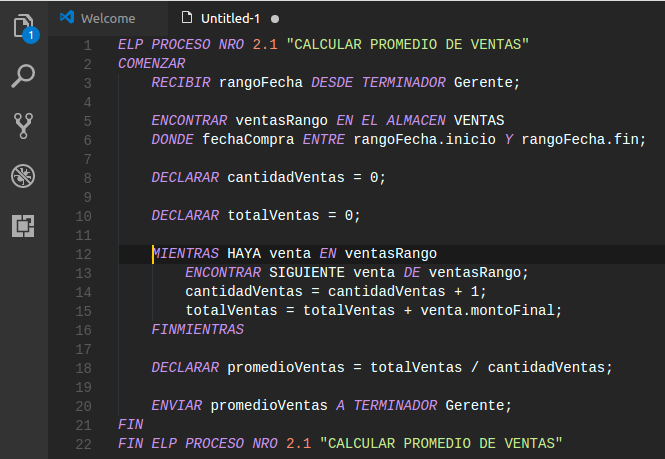

# Lenguaje Estructurado

Esta extensión aplica resaltado de sintaxis para el lenguaje estructurado, un lenguaje de especificación de procesos. Se aplica automaticamente a archivos con extensión ".est".

